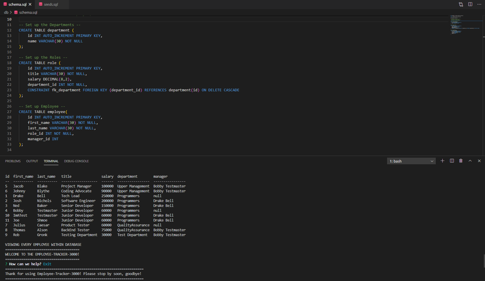
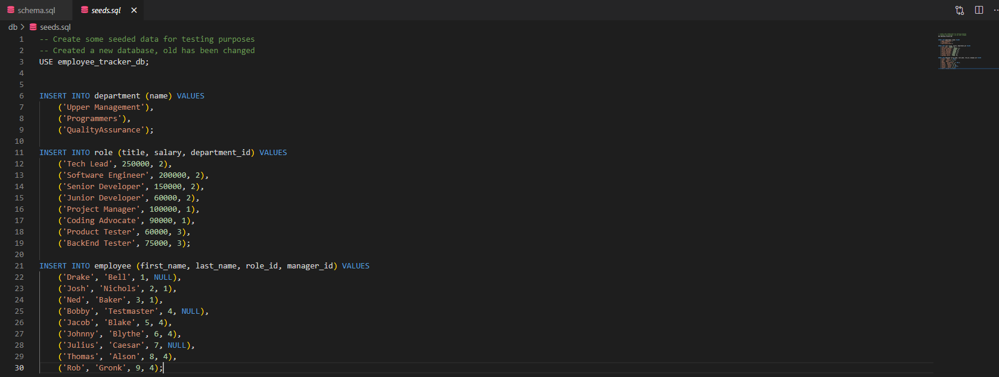

:computer: **Github Repo:** https://github.com/jwilferd10/employee-tracker-3000
 
:computer: **YouTube:** https://www.youtube.com/watch?v=N5QCHWOT0Ys&ab_channel=JonathanWilferd
## :open_file_folder: Table of Contents :
  - [Preview](#camera-preview)
  - [Description](#description)
  - [User Story](#book-user-story)
  - [Resources Used](#floppy_disk-resources-used)
  - [Installation](#minidisc-installation-and-usage)
  - [Contact Information](#e-mail-contact-information)

## :camera: Preview:

### Homepage:

### Saved Books:

### Demo:

## Description:

<em>Developers frequently have to create interfaces that make it easy for non-developers to view and interact with information stored in databases. These interfaces are called content management systems (CMS). Your challenge this week is to build a command-line application to manage a company's employee database, using Node.js, Inquirer, and MySQL.</em>

